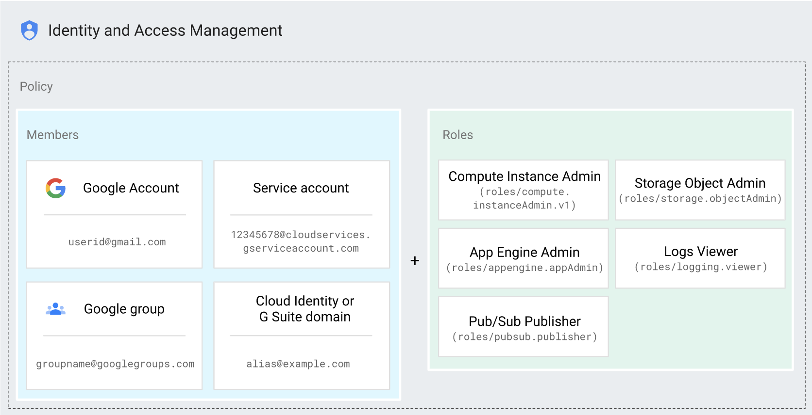

# Cloud IAM

Identity and Access Management (IAM) will be a topic requiring a deep 
understanding for the Cloud Architect Exam. IAM lets you grant granular access
to GCP Resources allowing you to adopt the security principle of least 
priviledge.

In simple terms, it lets you define a policy which states `who` `can do what`
on `which resource`:
  * The `who` being a person with an email account, a google group, or a 
    service account.
  * `can do what` indicates a role which contains a set of permissions which
    a user can perform on a particular resource.
  * `which resource` indicates the individual resource which the permissions 
    inside the role are applicable to.



## Syncing Active Directory with Cloud Identity

Some businesses may be using Active Directory to manage company Identity across
their domain. Seperately maintaining GCP accounts alongside Active Directory
will be cubersome and prone to errors.

`Google Cloud Directory Sync (GCDS)` will automatically sync Active Directory 
accounts to Cloud Identity accounts. This process is called `Federation`. It 
provides a one way sync, where all changes are maintained and managed in 
Active Directory, so the company does not need to change the way they were
managing the company users.

## IAM Roles

Roles can be grouped into three distinct types:
  * Primitive Roles: Broad original roles applied across entire project
  * Predefined Roles: Granular / specific access to a single service
  * Custom Roles: Ability to set custom permissions to a role 

## View & Edit IAM Policies

Policies can be updated via the web console within the `IAM & Admin` console 
view. Alternatively, you can update via the command line with the below commands

```sh
# Retrieve IAM Policy and download in yaml format
gcloud projects get-iam-policy (PROJECT_ID) > (filename).yaml

# Update IAM Policy from file format
gcloud projects set-iam-policy PROJECT_ID (filename).yaml

# Add single IAM binding to existing Policy
gcloud projects add-iam-policy-binding PROJECT_ID --member user:(user's email)--role roles/editor
```

## Service Accounts

A Service Account is a special type of Google Account which is used by an 
application to authenticate with Google Cloud Resources. There are two types of
Service Accounts:
  * Google Managed: Represent different google services and automatically 
    granted IAM permissions. Generally won't be using these.
  * User Managed: Created by you / for you, based on the APIs enabled inside
    your project and the needs for your application.

Service Accounts are treated both as a Member and a Resource when it comes to 
IAM. 
  * Service Accounts are granted permissions to a resource.
  * Users are granted the `serviceAccountUser` permission on the Service Account
    resource itself.

### Keys

Access to service accounts is managed by keys. Keys can be a Google Managed 
Key or a User Managed Key. In general, if your code is running on GCP it is 
recommended to have a Google Managed Key, but if your code is running elsewhere,
say on premise and has to access GCP resources, it is recommended to have a 
User Managed Key.

### Scopes

Scopes are a legacy method for providing access to Service Accounts. The Default
Service Accounts created for resources which are enabled via an API will have
there permissions granted via scopes. 

Custom made service accounts, will have their access granted to them via the 
regualar IAM policy bindings specified by you.

Scopes are special in that a more restrictive scope will in fact overwrite a
less restrictive IAM permission applied at a parent level. This is due to the
legacy way in which access was managed through GCP.

### Service Account Overview

* Service Accounts grant application / vm access to GCP resources
* Users are granted access to act as a service account
  * Service accounts are granted access to GCP resources
* Service accounts use keys for access
* Service accounts are granted access based on scopes and IAM policies

## IAM Best Practices

`Principle of Least Privilege`

* Give people just enough access to do what they need, no more
* Use predefined roles over primitive roles
* Grant roles at the smallest scope necessary
* Treat each application component as a seperate trust boundary
  * Give each application its own service account
* Restrict service account access and restrict who can create / manage service 
  accounts
* Be very careful with owner roles as owner can change IAM policies

`Service Account Key Security`

* Rotate user managed service account keys
* Don't check in service account keys to source code, or leave in downloads 
  directory
* Name service account keys to reflect use and permission

`Auditing`

* Use Cloud Audit logs to regularly audit IAM policy updates
* Restrict log access with cloud logging roles
* Export logs to Cloud Storage for long term retention

`Assigning User Access`

* Use groups over individual access whenever possible
* Have more than one Organisation Administrator
* Seperate Production / Non Production environments across different projects

## Questions

* What is the difference between a default service account and a default 
  service account agent?
