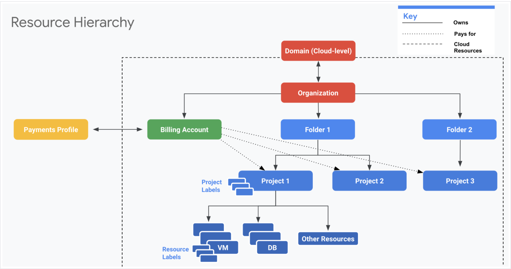

# Billing

A cloud architect will normally not be the one who pays the bill for the 
GCP resource costs, however knowing how to correctly setup a billing structure
is very important. There are two primary components we care about:
  * Assigning Billing IAM roles
  * Viewing and managing billing data

Billing Accounts sit underneath the Organisation resource, and not under a
project resource. However they are linked to one or more projects, which 
indicates that this billing account is the payer for this project.

## Billing IAM Roles

The following IAM policies can be defined related to the handling of billing
for a project. These are mostly applied at the Organisation level or Billing
Account Resource level.

  * `Billing Account Creator`: Able to create new billing accounts
  * `Billing Account Administrator`: Able to manage existing billing accounts, 
    but can not create new billing accounts
  * `Billing Account User`: Able to link a billing account with a project
  * `Billing Account Viewer`: Able to view billing information, handy for 
    finance teams
  * `Project Billing Manager`: Able to link / unlink accounts to projects,
    similar to billing account user, but with no access to project resources

## Viewing Billing Data

Viewing billing data is important to understand where your costs are going. You
can view in the web console, or alternatively export your billing data to 
cloud storage or big query.

Budgets and alerts can be setup to help you understand when a busget threshold 
has been exceeded. This will not halt the resources from operating, but will
prompt you that a cost threshold has been exceeded.
