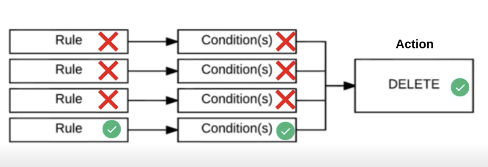

# Cloud Storage

Google Cloud Storage (GCS) is the unstructured data storage service on GCP. You
can use GCS to store anything, and virtually any amount of unstructured data.
It's costing is built on an elastic pay per use approach rather than paying for
an allocation of storage space.

There are two core concepts when talking about GCS:
  * `Buckets`: Primary unit which holds data, resource access is managed by IAM.
  * `Objects`: Objects are files which go inside the bucket

The `gsutil` command line tool provides a way to interact with GCS through the 
command line. For more information see the 
[gsutil documentation](https://cloud.google.com/storage/docs/gsutil).

## Storage Classes

GCS provides three different storage classes to choose from, each of which can
have a regional or multi-regional geolocation. The pricing of each class differs
as does the use case in how you would use each class.

You can modify the class of an existing bucket to another class, however you 
can't change the geolocation structure from regional to multiregional. If you 
do so, it will only apply to new objects being placed inside the bucket. 

`Standard`

Standard Storage Buckets are the commonly used storage class for most use cases.
There are no retrieval costs for accessing the data, and provides 'hot data'
capabilities for a single or multi regions based on the geolocation.

| Geolocation         | SLA                 | Storage Cost      | Retrieval Cost    |
|:-------------------:|:-------------------:|:-----------------:|:-----------------:|
| Regional            | 99.9% Availability  | $0.02 GB/Month    | N/A               |
| Multi Regional      | 99.95% Availability | $0.026 GB/Month   | N/A               |

`Nearline`

Nearline Storage Buckets should be used to store data which is not commonly 
accessed. As such, the pricing tier incorporates a retrieval costs, but has a 
lower overall storage cost.

On top of this, there are restrictions on how much you can use this data, which
for nearline storage buckets, is one per month. The use cases where this class
would be suitable would be for backup purposes.

| Geolocation         | SLA                 | Storage Cost      | Retrieval Cost    |
|:-------------------:|:-------------------:|:-----------------:|:-----------------:|
| Regional            | 99.9% Availability  | $0.01 GB/Month    | $0.01 GB/read     |
| Multi Regional      | 99% Availability    | $0.01 GB/Month    | $0.01 GB/read     |

`Coldline`

Coldline storage buckets have the same make up of the nearline class, however
there are tighter restrictions on the data access. For coldline storage buckets,
access can be obtained once per year.

The use case for this class would be to store any 'cold' files which ideally 
never need to be accessed, i.e. legal compliance, disaster recovery etc.

| Geolocation         | SLA                 | Storage Cost      | Retrieval Cost    |
|:-------------------:|:-------------------:|:-----------------:|:-----------------:|
| Regional            | 99.9% Availability  | $0.007 GB/Month   | $0.05 GB/read     |
| Multi Regional      | 99% Availability    | $0.007 GB/Month   | $0.05 GB/read     |

## Security Concepts

GCS access is left up to you, it can be as open, or as closed as you choose.
This should not be treated lightly! Often GCS buckets will store confidential
information, and misconfiguration of the access to those buckets can result in
private data being leaked to the public.

There are three methods to gaining access to objects in Cloud Storage:
  * `IAM`: Same approach as the rest of the GCP landscape
  * `Access Control Lists (ACL)`: A finer grained access control which lists a set 
    of users and what permissions they can do at the bucket, or object level.
  * `Signed URLs`: Provides anyone who has the url access to the resource for 
    a set period of time.

Which approach is recommended?
  * IAM is recommended over ACL as it provides enterprise access control which
    aligns with the rest of GCP. It also leaves an audit trail for access.
  * ACL is recommended when a finer grained access control is needed, i.e. 
    access at a particular object within a bucket, and no further objects. Note,
    when using ACLs for access, it does not leave an audit trail.
  * Use Signed URLs only for temporary access where you need to access something
    without singing into GCP.

## Object Versioning

Object versioning is disabled by default, but can be enabled at the bucket 
level. When enabled, deleted / overwritten objects are archived instead of 
permanently deleted.

There is no limit to how many versions can exist for an object, so the impact on
cost should be a consideration when enabling.

When talking about versioning, the below terminology is frequently used:
  * `Generation`: Each version will have a generation number attached
  * `MetaGeneration`: Metadata stored alongside the generation 

## Object Lifecycle Management

Object lifecycle management differs from object versioning, however the two can
be paired together. Object lifecycle management is concerned with creating a 
set of rules, which have a set of conditions, which when triggered, will 
perform an action on the object.

One example of why you might do this, could be to downgrade the storage class
of objects older than 365 days.

A `Rule` may have one to many conditions, which must all be true for that rule
to trigger the execution of an action.

A `Condition` contains a single criteria which needs to be met before taking the
action. The set of possible conditions are:
  * Age
  * Created Before
  * Is Live
  * Matches Storage Class
  * Number of Newer Versions

An `Action` is the event which is performed once all the criteria in the rule
is met. There are two possible actions which can be performed on objects:
  * Delete: Can permanently delete the object
  * Set Storage Class: Can change the storage class to a coldline or other class

An action can have many rules linked to it, and only needs one of those rules
to be true for it to be triggered.

