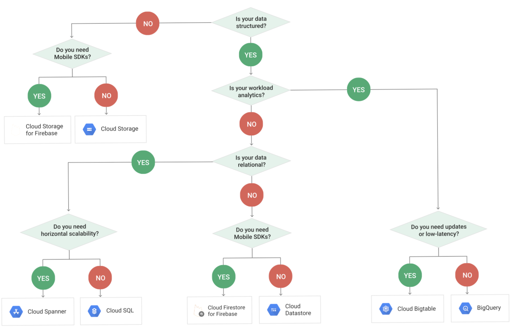
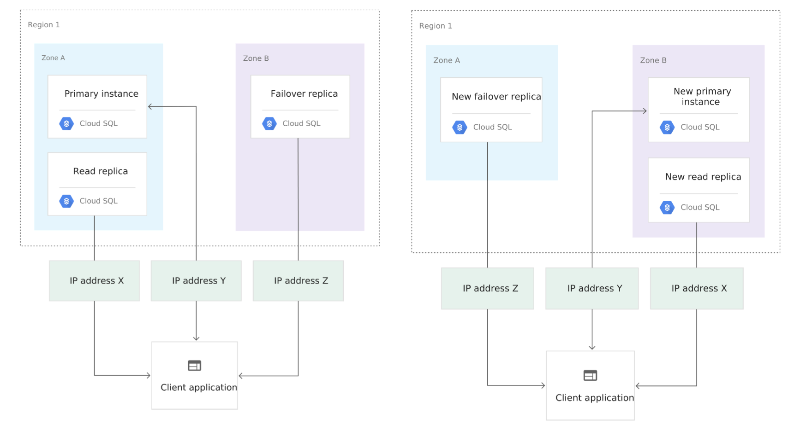

# Managed Databases 

GCP offers many managed databases on the platform which can be used for storing,
ingesting and using structured data. Each one has a specific purpose and will be
suitable for a different use case. The architect exam will test your ability to
choose the right solution for a provided use case.

When thinking about what solution is the right one for this use case. Think 
about the following questions.

  * Scalability and Availability (how does the system grow / scale?)
    * Horizontal or vertical scaling
    * Global or regional availability
    * What are it's limits

  * Relational or Non-Relational (what type of data is being stored?)
    * Strong consistency or eventual consistency

  * Transactional or Analytical (what is our interaction method?)
    * Transactional for simple queries, will be on the operational data sets
    * Analytical for complex queries, consolidated data sets

The below diagram will assist in choosing the right solution for your use case:



## Cloud SQL

A hosted MySQL or Postgres Database instance. Is often used as the first step 
for a migration to the cloud as it provides a capability to 'lift and shift' 
existing Postgres / MySQL database instances on prem to the cloud with ease.

It provides a traditional SQL database solution, but manages the below items
for you:

  * OS installation / upgrading
  * Storage
  * Backups 
  * Failover and read replicas (usage of read replicas up to consumer)

However is suitable for a subset of use cases due to its limitation in the 
below areas:

  * Vertical Scaling capped at 30TB
  * Single region only, meaning regional availability

### Improve Availability & Redundency

By default Read Replica and Failover instance are not enabled by default, but 
can easily be turned on. The failover instance must be created inside a 
different zone to the primary instance, but has to be in the same region.

Once enabled, data will automatically be replicated to the failover instance. 
In case of the event where your primary instance falls down, Cloud SQL will then
switch to make the failover instance the primary instance. Any configured read
replicas will then also convert to the being in the same zone as the failover 
instance.

There is often some lag time which can happen during switching to the failover 
instance. This can be addressed by increasing the RAM / CPU of the failover 
instance, or sharding the database to reduce the amount of write operations.



### Scaling your Cloud SQL Instance

As discussed, Cloud SQL is a vertically scalable database solution. By default,
storage scales automatically (can be deselected as an option), however compute
does not.

When increasing storage, there is no downtime required, however when scaling 
compute a restart of the instance is required. Therefore when planning for 
database compute scaling we can either:

  * Overprovision to cater for any future requirements to scale
  * Set an alert and monitor any the CPU utilisation, and manually scale when
    required. This is more cost effective, but will require a restart.

## Cloud Spanner

Another traditional SQL database solution, differing from Cloud SQL in that it
is horizontally scallable. In addition to this, it comes with cross region 
availability. It provides all the advantages of a relational database without 
the regular drawbacks that come with it. However it comes with a price, this 
solution is considerable more expensive than others.

## Datastore / Firestore

Cloud Datastore is currently in a migration phase to become Cloud Firestore. It 
provides a non-relational solution structuring data in key / value pairs, with 
a flexible data schema.

Completely no ops, meaning there are no individual machines to interact with, 
and can scale with your application, from zero to terrabytes.

Good for a mobile / web application use case.

## BigTable

Non relational datastore suitable for analytical use cases. Unlike Datastore, 
this solution requires you to manage the nodes it runs on and is not no-ops.

This will lead to a much higher performance, but with so comes a greater cost.
The use case at which this solution would become suitable is with a dataset in
the range of terrabytes to petabytes.

Just like how cloud spanner is the heavy hitter in the relational database space
BigTable is the heavy hitter in the non relational space.

## BigQuery

Fully managed no-ops database solution suitable for data warehousing. It 
provides a SQL interface for performing data analytics/warehousing queries.

This kind of solution is not an ideal solution for an operational database.

### Viewing Job / Query History

BigQuery logs all access to the datasets contained within it, similar to 
stackdriver. We can query this history to understand what queries / jobs a user
has performed on a given dataset. The command to do so is:

```sh
bq ls -j -a $PROJECT_ID
```

The job history will persist for up to 6 months and can be viewed with the 
BigQuery Admin user role. BigQuery User and JobUser roles can only view own.

### Access Control to Datasets

BigQuery datasets use IAM to determine who can access what datasets. IAM roles
can be assigned to the Project in which they are inherited to all datasets in
that project, or they can be applied to a particular dataset in a project.

The list of roles can be found here: [BigQuery IAM](https://cloud.google.com/bigquery/docs/access-control#bq-permissions)

A common use case is where a user might want to query the data contained in a
dataset within another project, but have the billing applied to the project 
they are within. To do this we need the following roles applied:
  * `BigQuery User Role` to the project which has the billing applied
  * `BigQuery DataViewer Role` to the projects / datasets wanting to query

### Partitioned Tables and External Sources

BigQuery tables can be partitioned to reduce the search set that they query on.
Doing this will improve performance and reduce costs as the table within 
BigQuery will reduce in size. The two ways in which you can partition a table:
  * Based off `Ingestion Time`
  * Based off `Timestamp in a certain column`

Tables can have an expiration date assigned to them to ensure the data does not
remain there forever. This is to help reduce costs for data which might only be
used a few times. However, any dataset which is not accessed for 90 days, will
automatically be converted into long term storage (nearline).

If you don't want to load your data into BigQuery, you can also use BigQuery to
query data from the following locations:
  * BigTable
  * Google Cloud Storage
  * Google Drive

However, you would normally do this on datasets which are constantly changing.
As this does not require you to reload the data in, however the performance of
the queries will be impacted.

## MemoryStore

A managed in-memory datastore, similar to redis. Provides sub millisecond data
access as data is stored in memory instead of on disk.

It comes with it's own limitations being:
  * Capped at 300 GB capacity
  * Single region availability
  * Failover can only be on two zones within the same region due to above 
    limitation

## Alternatives to Managed Databases

You don't have to choose a managed database when migrating across to the cloud.
There are a range of other database options which are able to be run on 
Compute Engine, the only downside is that you will have to manage and maintain 
the database on your own including the creation of high availability / failover
mechanics.
