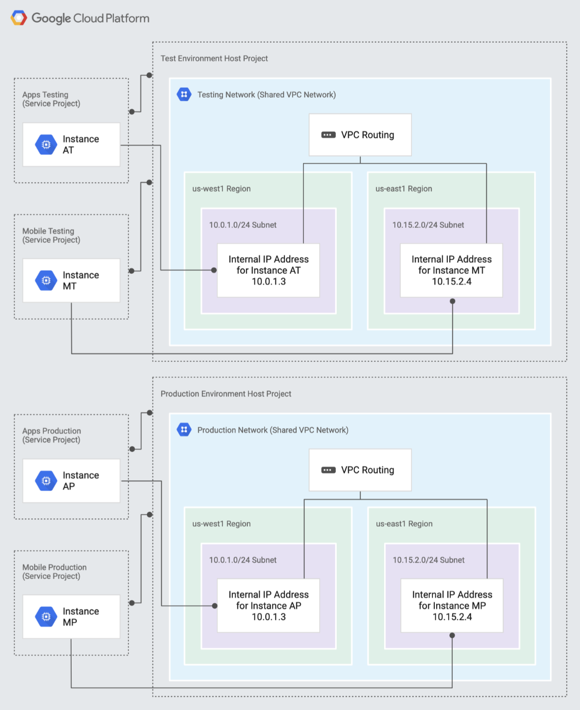
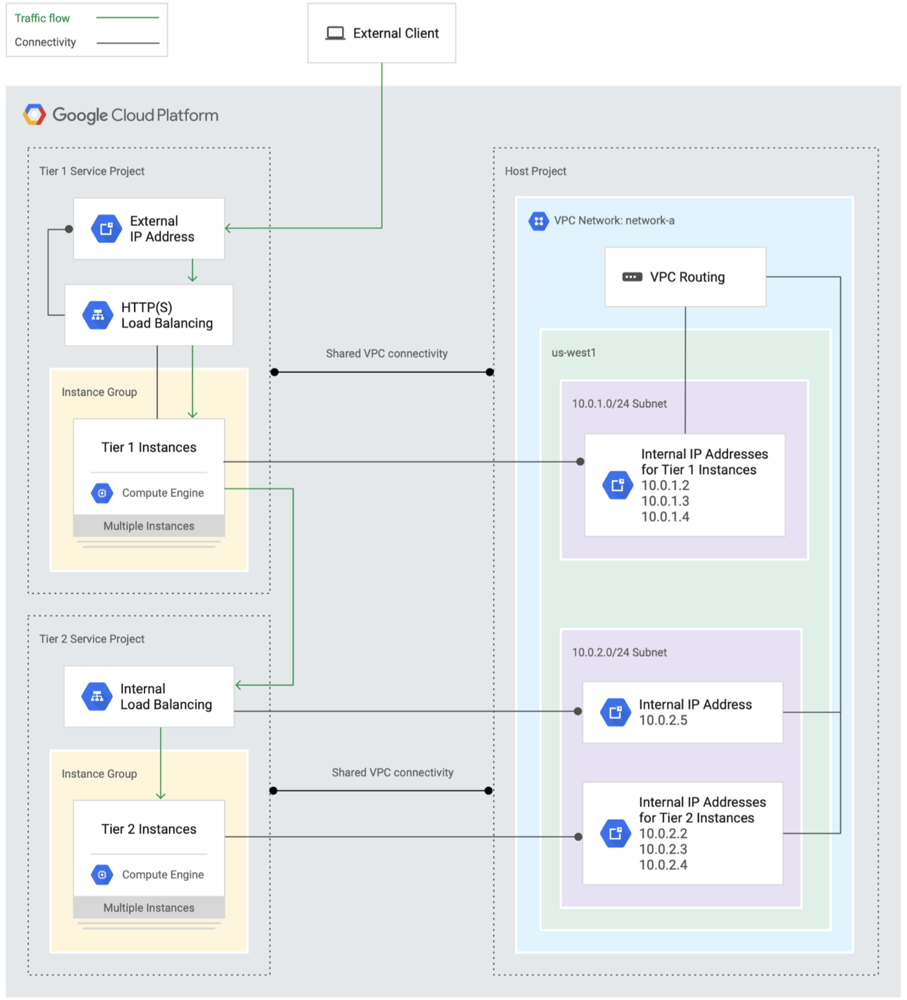

# Virtual Networks

Virtual Private Clouds (VPC) are a software defined network, which represent a
virtual version of a traditional network. VPCs are the central foundation for 
all other networking functions within GCP.

VPCs on GCP offer a global (multi-regional) communication space, meaning a VPC
can offer communication between subnets within different regions. However, a 
single subnet must be contained within a single region, it can span across zones
within the single region.

Traffic to/from a VPC is controlled via firewall rules, where ingress is free, 
but egress has an price associated with it.

VPC instances can have both an external and internal IP associated with it. 
Hybrid networking options with on-premise networks via a VPN are available.

IAM roles for VPC's fall under the Compute Engine resource. Within Compute
Engine IAM there are two different Admin roles:
  * `Compute Admin` - Full access to both instance and networking admin roles
  * `Compute Network Admin` - Full access to just networking admin roles

## Firewalls

Firewalls contain a set of rules which manage all `ingress` / `egress` traffic 
to instances contained within a VPC. These rules are defined at the VPC level
but enforced for all instances within the VPC.

Firewall rules can be created based off the following configuration options:
  * `Direction`: Ingress/Egress
  * `Source`: Source location of traffic
  * `Destination`: Destination location of traffic
  * `Protocol` or `Port`
  * `Action`: Deny / Allow
  * `Priority`: Order of evaluation for matching rules

In addition to this, we can define network tags which allow particular rules to
be applied to the instances containing the defined tag, rather than having a 
rule applied to all instances within the VPC.

## Shared VPC

By default, VPCs are tied to a single project, meaning only resources can only 
be accessed within the same project. However, a need exists to share network 
resources across projects. To do this, we use a Shared VPC. Inside a Shared VPC,
anything which is running on `GCE` or `GKE` will be able to communicate with 
each other over the same network.

Why would we do this?
  * Projects provide the primary way of seperation of resources for access 
    control and billing.
  * By doing this we can still achieve this seperation, but allow instances
    across projects to share the same network for communication.

When setting up a Shared VPC, the following concepts are important to note:
  * `Host Project`: Is the project which hosts / contains the Shared VPC
  * `Service Project`: Is any project which has access to use the Shared VPC
  * `Standalone Project`: Any project without permissions to use the Shared VPC

Shared VPCs have the following restrictions:
  * Can only exist within a single Organisation resource
  * Service projects can only be linked to a single Host project
  * Existing projects can use Shared VPC, but existing instances will need to 
    be recreated and migrated
  * A Project cannot be both a Host and a Service Project
  * Reserved IP addressed are tied to the Project which reserved it

### Use Case - Seperation of Testing and Production Environments

The below diagram illustrates how one would setup two environments which are 
isolated from one another. This could  represent a test and a production 
environment. It is important to note the Internal IP addresses for instances
are the same in each environment.

### Use Case - Two Tier Web Application

The below diagram illustrates how one might setup a two tier web application, 
where an external client communicates with the first tier in a project, and 
that tier communicates with a second tier contained within a seperate project.

