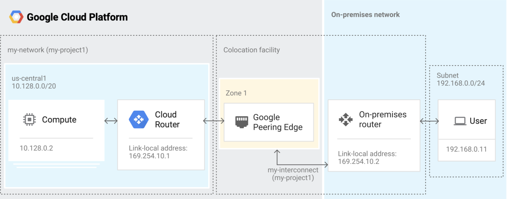
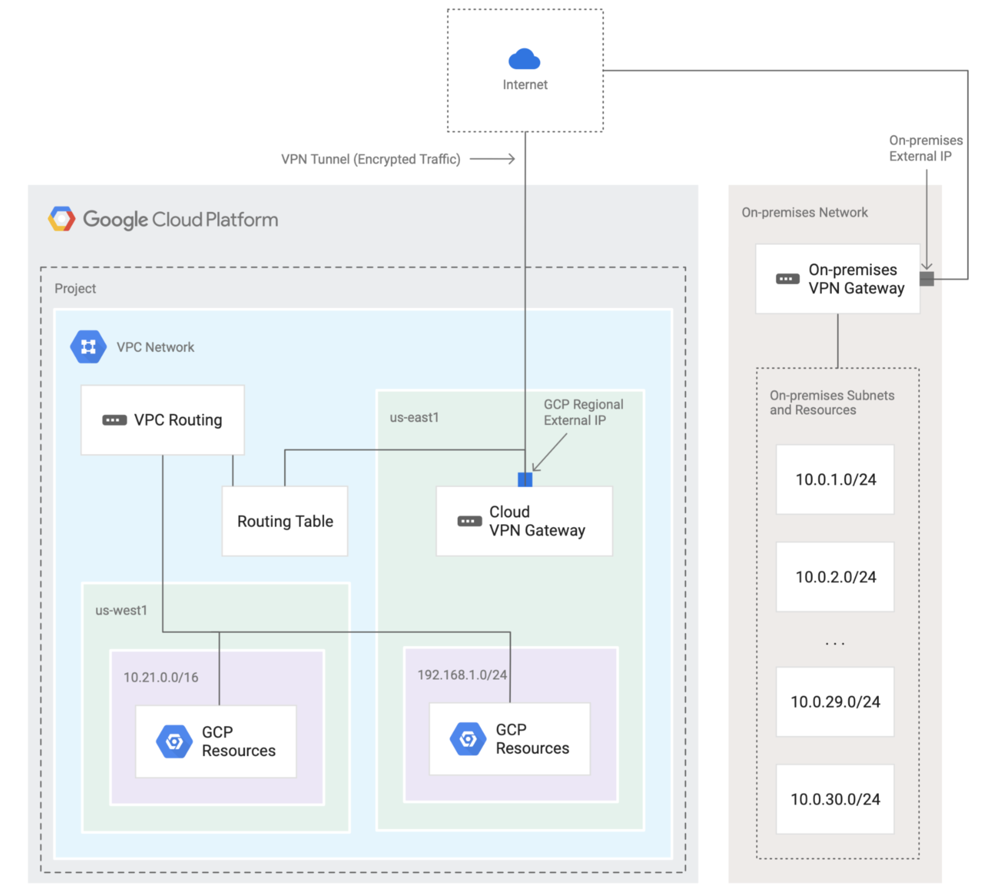

# Interconnecting Networks (Hybrid Networking)

Within GCP, all regions are in themselves, contained within one single private
network. Therefore, by default, communication between regions and on-premises
never touches the public internet.

This is unique to GCP as opposed to other cloud providers and means we get the
following benefits: 

  * Single Global / Cross - Region VPC 
  * Global internal DNS / Load Balancing / Firewall Rules / Routes
  * Global Public DNS

To connect your network to the GCP network you can do so in one of three ways. The following  
topics will discuss each in more detail.

## Cloud Interconnect

Cloud Interconnect allows you to physically connect your on-premise network,
to the Google Network (not Google Cloud Network), via a Google Edge location.
A Google Edge location is a location which bridges the Google Network to the 
public internet. There are a number of these around the globe.

To connect your network via a Google Edge location, you can use a Google direct 
connection, or you can go through a carrier.

This is an expensive and quite heavy option, the costs accosiated are below
  * $1700 per month / 10GBps link.
  * Up to 80 GBps total.
  * This also leads to reduced egress fees 

When would I want to use this option:
  * If you do not want your traffic to touch the public internet
  * Need extremely high speed connections - 80GBps per interconnect
  * High volume of egress for reduced fees
  * Use private Google Access for all on-premise hosts

When would I not use this option:
  * If you do not require high speed / low latency
  * If a peering location is not available
  * Need to access the public internet
  * Need to save costs

## Cloud VPN

Cloud VPN provides site to site VPN connectivity over IPSec. It connects your
internal network, to GCP, via an encrypted tunnel over the public internet.
Traffic is encrypted by one gateway, and decrypted by the other gateway.

This is the option which would be suitable for 'most' clients, and it provides 
a cheaper alternative to cloud interconnect. With Cloud VPN you set up to 8
connection tunnels to increase the speed at which you require.
  * Each tunnel supports 1.5 GBps
  * 8 Tunnels = 12 GBps through combined network
  * 99.9% SLA

Only connects on-premise to GCP, it does not support connecting a local client
option to your site. Eg, a local laptop to GCP VPN.

### Requirements for use

To be able to correctly setup the a Cloud VPN connection, the following must 
exist:
  * VPN Gateway must exist on both ends
  * Peer Gateway must have a static IP address, if behind a firewall, rules
    must be setup to allow communication with the VPN Gateway
  * Non conflicting CIDR range / subnet across both the two networks

### Routing

There are two options for handling routing across your VPN connected network.
  1. Static Routing
  2. Dynamic Routing via Cloud Router

If using `Static Routing` you will need to manually update the routing table
for all existing and new routes. If the link fails, you can't reroute traffic.

`Cloud Router` provides a Dynamic Routing capability over the Bridge Gateway
Protocol (BGP) to automatically discover and update your routing table as new
routes are updated. This is only compatible if your Gateway supports the BGP
protocol.

## Peering 

Peering allows you to connect your business directly to google, not just GCP, or
a VPC within GCP. You may want to do this to be able to exchange internet 
traffic with google for particular use cases such as directly connecting to 
G Suite. The options for doing so can be direct or through an external carrier.

VPC Network Peering is also an option, which allows you to connect two VPC 
networks, possibly within two different organisations, over GCP private network. 

## Google Cloud DNS

Googles managed service for Global Available Domain Name System service. This 
is the only google service which provides a 100% SLA for availabitity.

DNS is hosted in a single project, and you can setup both public and private 
zones.
