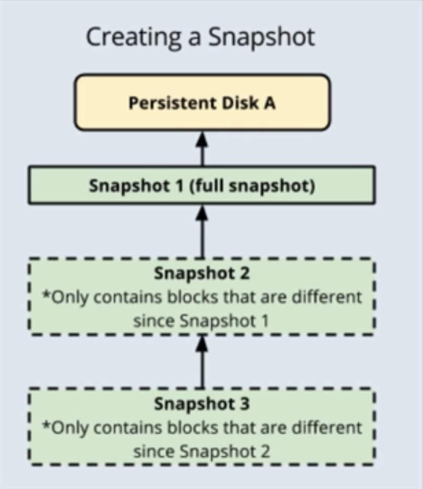

# Virtual Machines

VM's are the central building block for Google Cloud Platform. When using GCE,
GKE and GAE you will be working on top of resources running inside a Google
Compute Engine VM. As such, there is a heavy focus on VMs inside the exam.

## Disks

All VM instances have a single root disk for the OS. The type of disk can be one 
of the three following options.

  1. Persistent Disk
      * The only boot option available and is the standard
      * Standard Machine or SSD variety
      * Not directly attached to the instance rather network attached storage
      * Benefits of redundancy and reliability due to not being attached
      * Modular approach means you can preserve data after instance is deleted
      * Resize, move and attach additional disks as required

  2. Local SSD
      * SSD disk physically attached to the instance
      * Highest performance but comes at a price
        * Trade performance for reliability / flexibility
      * Unable to use as boot disk, must create on instance creation
      * All data is lost if instance is deleted
      * Non configurable 375GB size, can attach up to 8 disks

  3. Cloud Storage Bucket
      * Alternate option to use a GCS Bucket as your disk
      * Cannot be used as a boot disk
      * Lower performance than others, but provides infinite storage
      * Global accessibility
      * Most flexible and scalable option

## Images

Images are necessary to create boot disks for GCE instances. Public images are 
accessible by all and maintained by Google and other vendors, these include
OS images and application images. Custom images can be created by you to 
initialise boot disks base off your own configurations / needs.

Both images and snapshots can be used to create new VM instances, however the 
use of snapshots should serve more as a backup tool, where as custom images can
be used as a pre defined template for initialising instances. Both can be 
accessed across projects.

When maintaining custom images the below points should be known:

  1. Creation:
      * Can be created from multiple sources:
        * Persistent Disk 
        * Another image in same project / other project
        * Compressed image from Cloud Storage

  2. Managing:
      * Image families simplifies image versioning 
      * Groups related images together
        * Roll forwards / backwards between image versions
        * Family always points to newest non-deprecated image version

  3. Deprecating Images:
      * Custom images are continually updated, need to retire old versions
      * Need to be able to transition users away in a managable way
      * The deprecation states for a custom image are:
        * Deprecated: Still works but gives warning
        * Obsolete: New users cannot use. Will error if attempted. Existing links still work.
        * Deleted: All users cannot use.
        * Active: Works for all users.

  4. Sharing / Moving Images:
      * Can share images across GCP projects 
        * Need Compute Engine Image User IAM role
      * Can also export images to Cloud Storage.
        * Linux only, not applicable to Windows
        * Ideally for sharing with projects without host project access
        * Sharing with Image User Role recommended

## Snapshots

A snapshot is a periodic backup via a point in time snapshot of a disk. Snapshots
are created in an incremental way, meaning each snapshot will contain only the 
blocks which differ from the previous snapshot. This ensures we save space when
creating snapshots. The below image represents this:

If a snapshot was deleted, let's say in the above example snapshot 2 was deleted,
the blocks that were unique to snapshot 2 get moved into snapshot3, so now 
snapshot 3 contains the diff between snapshot1 and itself.

Snapshots can be scheduled so that they are triggered on a regular basis. When
creating snapshots, the following best practices should be followed:

* Want to try and reduce activity when creating snapshots so everything is consistent
  * Pause applications / stop running processes that write data
  * If possible, unmount disk completely
  * For windows, use VSS Snapshots
* Take only one snapshot at a time, per disk
* Schedule during off peak times
* Use multiple persistent disks for large data volume

## Startup / Shutdown Scripts

Allow you to programmatically execute tasks on instance startup and shutdown.
This can be useful to do software updates / installs, update services etc.

These scripts will always be run as root/administrator and can run any type of
script which the operating system recognises i.e bash, python etc.

These can be directly input at the time of creating the instance, or you can
specify a link to a script contained in a GCS bucket which will be executed.

Shutdown scripts are executed on a best effort basis. Since they are run during
shutdown there is no guarantee the shutdown will not occur before the script 
completes.

## Preemptive VMs

Preemptive VM's are short lived VM's which are considered disposible. These are
a great candidate for some solutions as they are low in cost in comparison to a 
normal VM, this is due to the fact that it may be disposed of at any time (24 
hours max).

These VM's are a good choice for fault tolerant batch processing workloads. The 
workload must be designed in a way that it is able to continue should it shut
down. But using this you can save up to 80% on the cost of the compute of your 
instance.

It is important to note, that the cost savings are only applied to the instance,
not to storage (disk) or any licensing which might be applied on the running VM.

Some best practices to avoid your preemptive VM from being shut down:
* Use smaller machines
* Run during off peak times
* Design application to be fault tolerant
* Preserve disk on machine termination
* Use shutdown scripts
