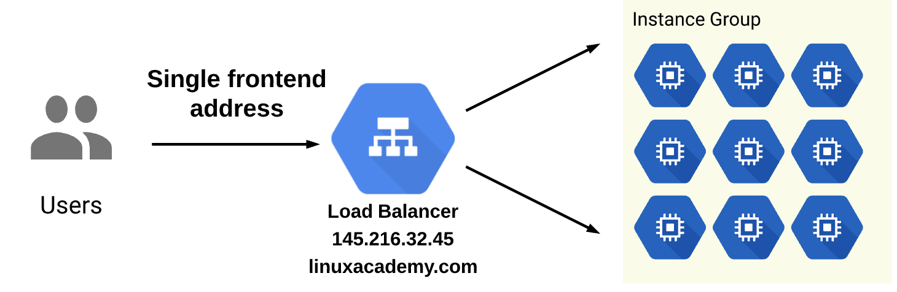
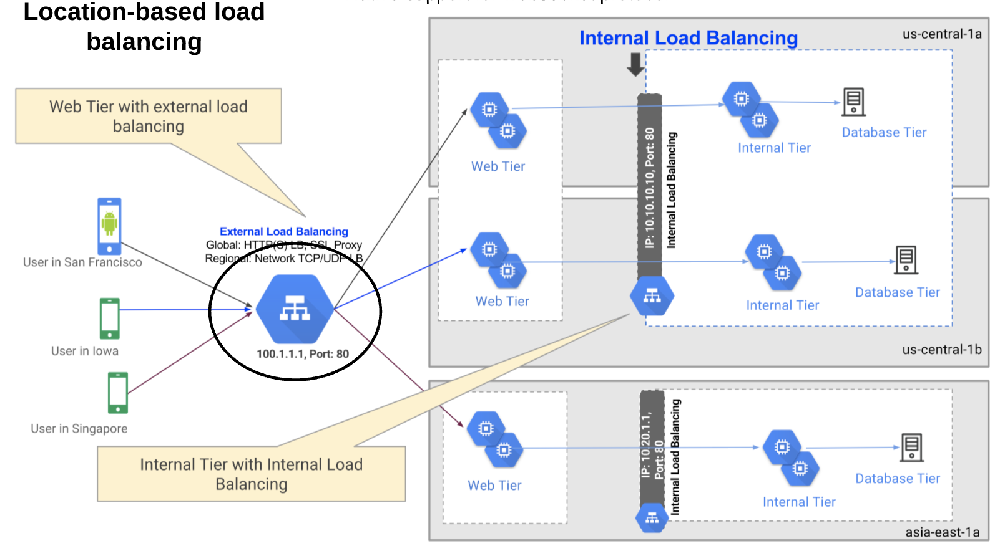
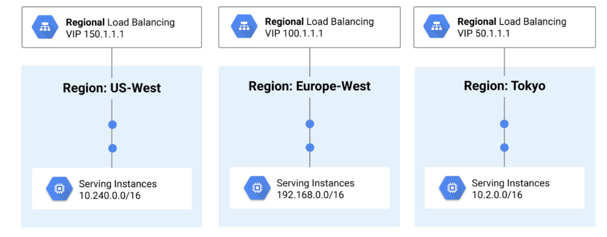
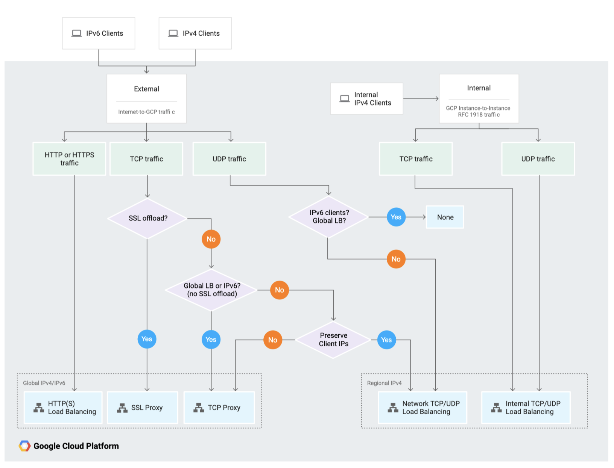
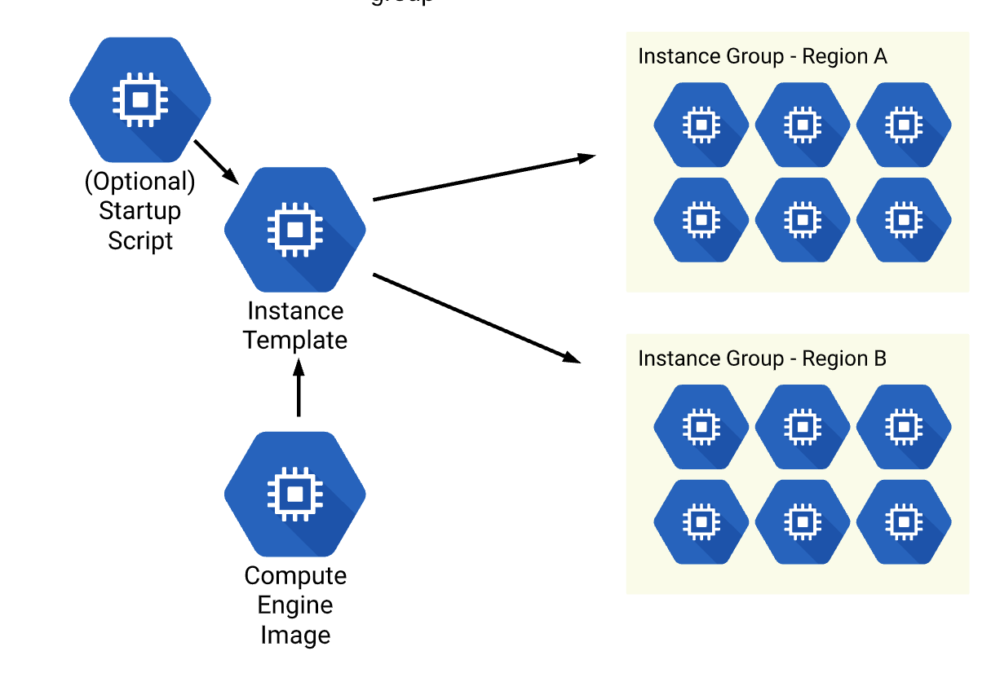

# Load Balancing and Instance Groups

This section begins to take all the previous concepts and demonstrate how you 
can use force multipliers to achieve scalability on the cloud.

## Load Balaners

A Load Balancer acts as a bridge between inbound traffic and the instances which
will serve that traffic. They expose a single front end point of access and 
distribute the load of traffic to the many backend instance targets.

Load Balancers are software defined (not physical), and can be one of many types.
Each one can either be:
  * Global vs Regional in scope
  * External vs Internal in traffic they can serve
  * HTTP vs TCP/UDP (layer of OSI Protocol)

### HTTP(S) Load Balancer

A HTTP Load Balancer manages HTTP Requests. As such these operate as a Layer 7 Load Balancer.
They are able to forward traffic to many regions, and can handle IPv4 or IPv6 traffic.
For IPv6, the IPv6 is terminated at the Load Balancer and proxied by IPv4 to the
backend.

Forwarding rules can distribute traffic by location or content served. Rules for
forwarding traffic defined and selected by matching criteria.

The characteristics of a HTTP Load Balancer are summarised below:

| Characteristic |      Value     |
|:--------------:|:--------------:|
|      Scope     |     Global     |
|     Traffic    |    External    |
|    OSI Layer   | HTTP (Layer 7) |

### Network Load Balancer

Network Load Balancers manages TCP/UDP traffic. As such these operate as a Layer 4 Load Balancer.
They can operate as both External / Internal Load Balancers, the difference being
that an Internal Network Load Balancer will operate inside a VPC with internal
IP addresses only. Both of which are regional in scale.

Both balance requests by IP protocol data such as address, port and protocol type.
Forwarding rules then match the incoming request and send to a target pool.

The characteristics of the External Network Load Balancer is summarised below:

| Characteristic |      Value        |
|:--------------:|:-----------------:|
|      Scope     |     Regional      |
|     Traffic    |    External       |
|    OSI Layer   | TCP/UDP (Layer 4) |

The characteristics of the Internal Network Load Balancer is summarised below:

| Characteristic |      Value        |
|:--------------:|:-----------------:|
|      Scope     |     Regional      |
|     Traffic    |    Internal       |
|    OSI Layer   | TCP/UDP (Layer 4) |

### SSL / TCP Proxies

Other options are SSL / TCP Proxies. Both of which are global in scope and 
operate on external traffic.

The characteristics of SSL / TCP proxies are summerised below:

| Characteristic |      Value        |
|:--------------:|:-----------------:|
|      Scope     |     Global        |
|     Traffic    |    External       |
|    OSI Layer   | TCP/UDP (Layer 4) |

### Deciding which Load Balancer?

The below flow chart illustrates which Load Balancer should be used for each 
use case.

## Instance Groups & Autoscaling

Instance groups allow us to manage a group of instances together rather than 
individually one at a time. Instance groups can be managed or unmanaged, with
managed being what is covered in the exam.

Managed Instance Groups provide the following capabilities:
  * Automatically scaling
  * Health Checks with auto healing
  * Works with Load Balancing

**An important concept: Pets vs Livestock**

When talking about instance groups, it is common to refer to your management
approach using the pets vs livestock approach.
  * *Pets*: Talks about instances which are high value in nature. 
      These are indispensible in nature and cannot go down. As such each instance
      needs to be backed up independently. Limited scalability (Vertical Scaling).

  * *Livestock*: Talks about instances which are built en masse and not as critical in nature.
      As such, they can tolerate downtime and are designed with failure in mind.
      Can scale much easier with horizontal scaling.

Some examples of Pets instances might be database instances which store state on 
the machine, compared to an example livestock instance which might be a stateless
kubernetes app which stores it's state elsewhere.

### Creating an Instance Group

To create an Instance Group you must first create an instance template. The instance
template defines things such as Machine Type, Group Configuration, Zones, Images
and scripts, and has a Global Region availability. Meaning you can create an instance
in any Region.

Once you have an Instance Template, you can then create an Instance Group based off
that template. The Instance Group will be Regional but you can use more than one
zone within that region.

You can use either startup scripts or custom images to ensure your instances are
setup at the time of booting up your instance group. However custom images might
be more suitable if you need to install multiple dependencies etc, to reduce the 
overhead required for each instance on startup. The image is simply ready to go
at the time of running.

### Firewalls

When combining Instance Groups with Load Balancers, inbound traffic will simply
pass through the Load Balancer, where any firewall rules will be applied at the 
Instance Group level.

### Health Checks

If an instance in an Instance Group is detected to be unresponsive, the group
will recreate a new healthy Instance to ensure the full group maintains 
healthy.

## Updating Instance Groups

Updates apply via the Livestock approach, where rather than updating each instance
independently, we update the group together.

To do this we can use the Managed Instance Group Updater which will progressivly 
rollout the new instances, then decommission the old instances only once all new
ones are healthy. We can also control the pace of the rollout here and achieve 
things like canary testing as well.
