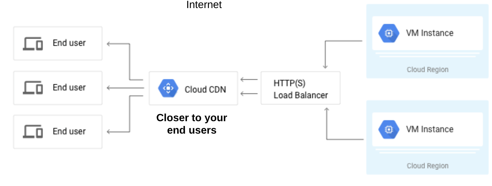

# Cloud CDN

Cloud Content Delivery Network (CDN) caches website and application data closer
to your end users to optimise performance. The closer your data is to the end
user, the better experience they will have.

CDN caches data at one of the 90 Cloud CDN locations, or Points of Presence (POP).
These act as a hop off point between Google's private network and the internet.

Cloud CDN is only available for use with HTTP(S) Load Balancers. How it works,
the first time a request is made, and the cache returns a miss, it will extract
the data from the target backend. This will then trigger a cache fill, where 
subsequent requests will return a cache hit and pull the data from the cache 
instead of the target backend.

Caches are queried using a cache key. By default, the cache key is the entire 
URL. You can customise your cache hit ratio by removing unneeded URL parts where 
applicable:
  * Access through different protocols returning same content (HTTP/HTTPS)
  * Look for similar query strings rather that exact match or the URL
  * Removal of host where www.example.com and example.com return the same
