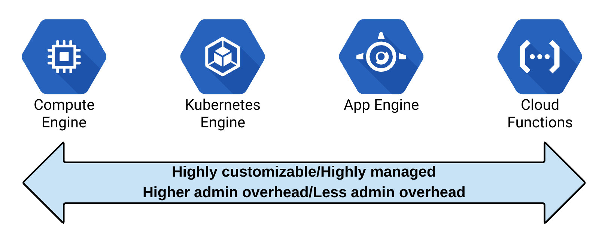

# Where should I run my code?

There are many options available for deploying your code on GCP. Which option
you choose depends on the level of control you want over where your application 
is deployed and hosted, and what kind of things you want to manage vs what you 
want google to manage for you.

## Compute Options

* Google Compute Engine
* Google Kubernetes Engine
* Google App Engine
* Google Cloud Functions
* Google Cloud Run

As a cloud architect, you should be able to take a set of business and technical
requirements, choose and implement the right compute option for your need.

Considerations to think about include:

* What do we want?
* What do we need to think about?
* What do we want Google to manage?
* What are the contraints of each compute option?
* What are the use cases we are solving?

The below diagram illustrates a sliding scale of where the options lie in 
comparison to one another. On the left side you have more control / ability to
customise but requires more management on your end. On the right you have less
flexibility in customising but manage less as Google takes that responsibility.

Note: Cloud Run falls in between App Engine and Cloud Functions.

## 1. Compute Engine - Infrastructure as a Service (IaaS)

Option comes with the most management overhead but most flexibility. Common use
cases would include:
* Moving existing servers to the cloud
* Applications with specific OS requirements

**What you want?**

* Virtual version of a physical computer
* Full control / flexibility for customisation purposes
* Default option if all others don't fit

**What you need to think about?**

**Constraints?**

* No contraints, comes with management overhead.

**What Google manages?**

* Hardware management
* Virtualization layer

## 2. Kubernetes Engine

A managed service for running kubernetes based applications. Common use cases
include:
* Containerized workloads
* Cloud Native microservices architecture

**What you want?**

* Kubernetes / container management
* Management over applications but not machines
* Portability of containers
* No dependencies on OS versions
* Network protocols beyond HTTP/HTTPS
* CI/CD pipelines

**What you need to think about?**

* Applications over computers
* How are applications / programs connected
* How is state stored for state based applications
* Cluster configuration

**Constraints?**

* Must use containerised applications
* Some architectural contraints - inter app communication

**What Google manages?**

* Managing the kubernetes cluster. Kubernetes the easy way
  * Node management, software updates, autoscaling.

## 3. App Engine - Platform as a Service (PaaS)

A Platform as a Service offering allowing you to focus purely on writing application
code. Common use cases include:
* Websites
* Mobile App Backends
* IoT apps

**What you want?**

* Only want to focus on code
* Handle variable load from zero to massive scale

**What you need to think about?**

* Your code
* HTTP requests
* Versioning of applications

**Constraints?**

* Standard Option limited in runtimes (Python, Go, Java, PHP, NodeJS)
* Flexible Option available - no scale to zero, slower scaling up/down compared to standard
* Always paying for something even when no one is using it

**What Google manages?**

* Everything outside of code
* Infrastructure, updates, scaling, network etc.
* Supports rapid scaling

## 4. Cloud Functions

A true serverless framework, where apps are instantiated on events. This allows
you to scale down to true zero meaning you only pay for what you use. Common
use cases include:
* Response to a PubSub / Cloud Storage Bucket event
* Low usage workloads

**What you want?**

* Scale down to zero, only pay for what you use
* Ability to respond to events
* Simple single purpose functions

**What you need to think about?**

* Events and what your functions do
* Google handles all else

**Constraints?**

* Limited runtimes (NodeJS, Go, Python)

**What Google manages?**

* Everything else
