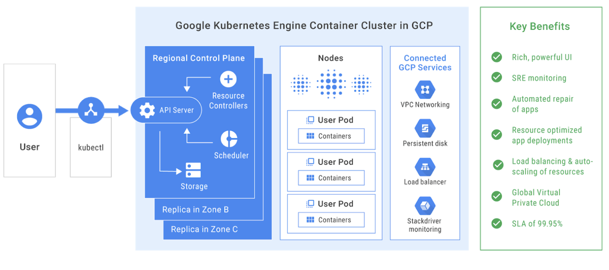

# Kubernetes Engine

The Cloud Architect exam will test your knowledge of the container deployment 
process and the tools involved in a common developer CI/CD workflow.

In summary, there is a three step process:

1. Build
  * Docker images need to be pulled from source registry and built somewhere
  * Cloud Build is Googles CI product which can support this

2. Store
  * Docker images need to be stored somwhere for later retrieval
  * Container Registry is Google private Docker registry
  * Can integrate with other internal products such as GKE, GCE, GAE 
  
3. Deploy
  * Need a mechanism to run the containerised application
  * This section focuses on Google Kubernetes Engine (GKE)
  
## Why use GKE?

Containers solved the problem developers faced in the past about making software
portible. No longer do we face the issue where the application works on one runtime
environment, but not another.

Kubernetes then introduced a platform for managing containerised workloads. It 
provides capabilities such as deployment, scaling, updating and load balancing.
Kubernetes does a lot of things in terms of container management, but there is a
heavy amount which you need to manage on the kubernetes side of things. These
include but not limited to:
* Setting up a CA and TLS Certificate Generation
* Setting up a TLS Client Bootstrap / RBAC structure
* Bootstrapping Kubernetes H/A etcd cluster, Control Plane & Workers

GKE takes the management side off your hand, where Google handles the OS management,
Master node, scaling, health checks, replication controller and all the other 
stuff, so you just have to focus on your containers. 

## Administrative Concepts

**Pod:**
* Represents the smallest deployable unit
* Contains one or more containers bundled inside it
* Each container has a base image referred to as the Container Image

**Node:**
* VM's the containers are hosted on
* Under the hood they are GCE instances
* Can have multiple Pods inside a single node

**Node Pool:**
* A group of nodes
* Under the hood they are a form of a managed instance group

**Cluster:**
* Abstraction for one or more Node Pools

You can interact with GKE through the use of both `gcloud` and `kubectl` cli tools.
* gcloud will be used to interact with the GCP resources (GKE cluster, Nodes etc.)
* kubectl will be used to interact with the applications on the nodes (Pods)



**Best Practices with Container Images:**

* Use slim base images like Alpine Linux - smaller deployment / security concerns
* Don't copy source files before installing dependencies, causes reinstalls
* Tag different versions of images with specific version numbers, not always latest
* Set pull policy to `IfNotPresent` instead of `Always`

## Useful Commands

**Cluster**

```sh
# Create Kubernetes cluster
gcloud container clusters create ${CLUSTER_NAME} --num-nodes=${NUM_NODES}

# Authenticate with cluster
gcloud container clusters get-credentials ${CLUSTER_NAME}
```

**Deploy**

```sh
# Deploy image / pod
kubectl create deployment ${DEPLOYMENT_NAME} --image=${IMAGE}

# Create LoadBalancer for deployment
kubectl expose deployment ${DEPLOYMENT_NAME} --type=LoadBalaner --port=${PORT} --target-port=${TARGET_PORT}

# Get details of LoadBalancer (ip, etc)
kubbectl get service
```

**Scaling**

```sh
# Scale number of pods
kubectl scale deployment ${DEPLOYMENT_NAME} --replicas=${NUM_PODS}

# Autoscale pods
kubectl autoscale deployment ${DEPLOYMENT_NAME} --max ${MAX_PODS} --min ${MIN_PODS} --cpu-percent ${CPU_PERCENT}

# Scale number of nodes on cluster
gcloud container clusters resize ${CLUSTER_NAME} --size=${NUM_NODES}

# Autoscale nodes on cluster
gcloud container clusters update ${CLUSTER_NAME} --enable-autoscale --min-nodes ${MIN_NODES} --max-nodes ${MAX_NODES}
```

**Update**

```sh
# Update image on deployment
kubectl set image deployment/${DEPLOYMENT_NAME} ${CONTAINER}=${IMAGE_NAME}

# Upgrade kubernetes version on cluster
gcloud container clusters upgrade ${CLUSTER_NAME}
```

**NOTE: Trick Question**

If you are to change the machine type on a cluster, you cannot actually do this.
You will need to create a new cluster and migrate your nodes / pods over to it.
