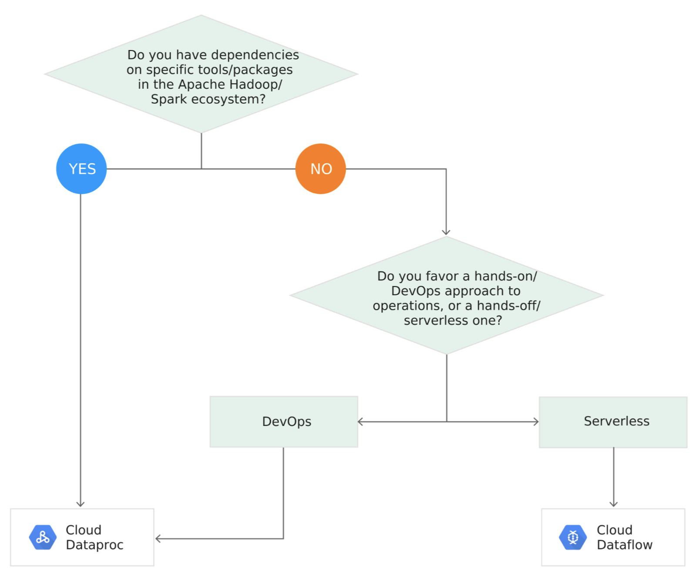
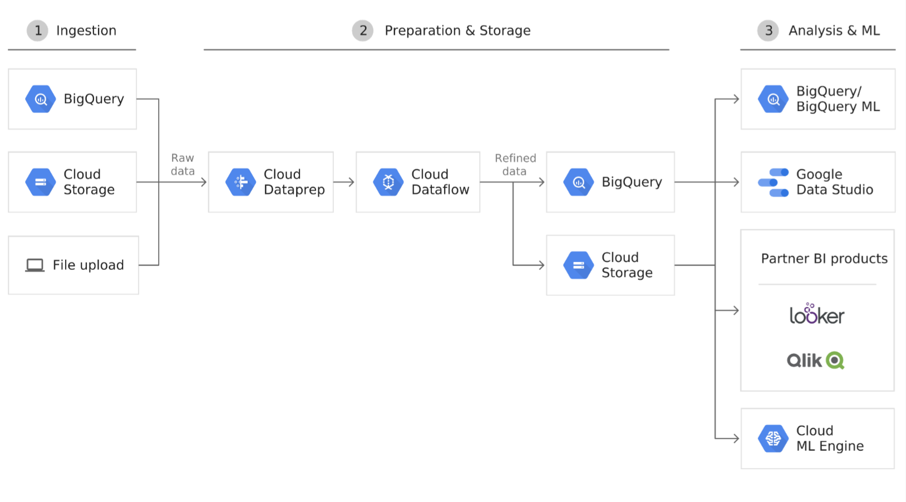
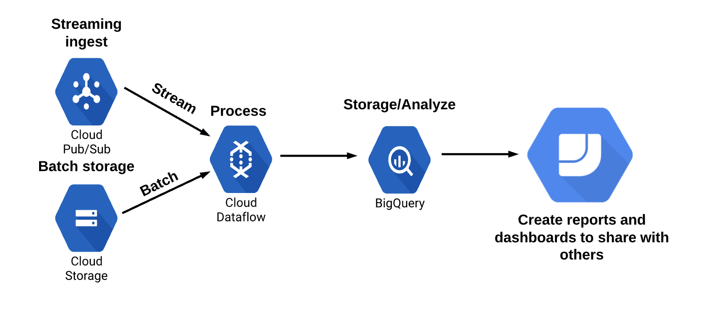
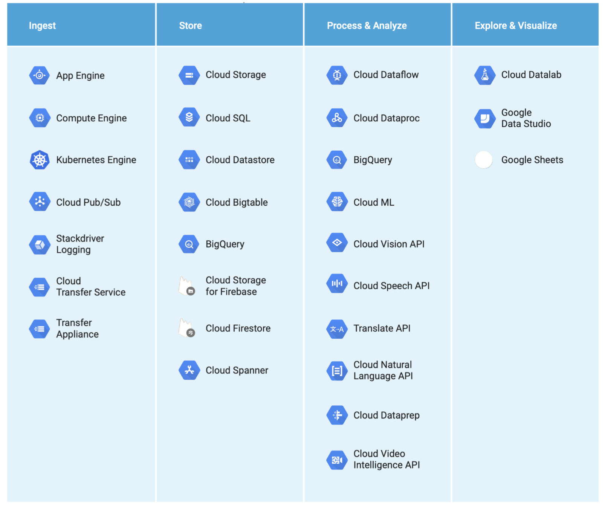

# Big Data & Machine Learning

Architect exam will require a breadth of understanding across the big data lifecycle.
You will not be expected to go into a depth of understanding of each of the services,
but you will be required to understand where each service fits in the process 
of solving big data problems.

First we will talk about each of the Big Data / ML Services, then we will focus
on the Data Lifecycle and map each service to a step in the process.

## Cloud Dataproc

Cloud Dataproc is a managed Hadoop ecosystem. It handles the cluster and management
of the Hadoop/Spark infrastructure so you can build workflows on top of it.
Spark is a popular machine learning ecosystem (different from GCP products).

This is useful for companies who are looking at doing a straight migration to
the cloud as they can 'lift and shift' their existing workloads and run them on
cloud provisioned infrastructure.

**Role in Data Lifecycle Puzzle:**

* Data Processing and Analysis

## Cloud Dataflow

Built on top of the Apache Beam framework, Cloud Dataflow allows you to build 
Batch / Streaming Data Processing Pipelines which can change / transform data 
from source to target.

* Streaming Data: Continuous stream of data. Asynchronous
* Batch Data: Large amounts of fixed data

This service aims to solve the problem where you might need to transform data 
before it reaches another service / destination. Allows us to have multiple 
streaming and batch data sources and keep them together.

**Role in Data Lifecycle Puzzle:**

* Data Processing

## Cloud Dataprep

A service allowing you to clean / transform your data in a preparation stage via
UI / Web Interface. This uses Cloud Dataflow under the hood to do the transformation.

Can schedule regular transformation jobs from sources such as Cloud Storage or
Big Query.

This service solves the problem where data is in the wrong format it needs to be
in to be processed, or if you need to regularly schedule 'cleaning jobs' on your
data before it is to be processed.

**Role in Data Lifecycle Puzzle:**

* Data Processing - Uses Dataflow in a simple click format

## Cloud PubSub

An asynchronous messaging system which aims to decouple publishers (those who
send messages) from consumers (those who receive messages). Consumers subscribe
to messages they are interested in receiving.

This service aims to allow you to do ingest streaming data from anywhere in the
world without worrying about capacity.

**Role in Data Lifecycle Puzzle:**

* Data Ingest
* Often paired with Dataflow for processing after ingestion

## Machine Learning Services

Machine learning involves teaching a program to understand data without explicitly
programming it to. There are a number of services within GCP which can provide 
these capabilities.

1. Cloud ML Engine: Provides managed resources for training own ML models
2. Pre Trained APIs: Google trained MLs which you can plug into your use case
3. New solutions are always in rapid development (Big Query ML)

**Role in Data Lifecycle Puzzle:**

* Analysis

## Data Visualisation Services

Used to visualise your data. A range of services available:

1. Datalab:
  * Based on top of Jupiter Notebooks
  * Visual analysis of data in Big Query, Cloud ML Engine and more

2. Data Studio:
  * Easy to use data visualisation
  * Drag and drop report builder
  * Not a GCP product but a GSuite / Cloud Identity Product

## Data Lifecycle

The different phases in the data lifecycle are defined below:
* Ingest: Collection of data from sources
* Store: Store the data for long term access
* Process & Analyse: Transform data from raw to actionable format
* Explore & Visualise: Get use out of the data

The products which map to each of these phases are shown in the illustration below:

Additional resources:
- [Data Lifecycle](https://cloud.google.com/architecture/data-lifecycle-cloud-platform)
- [Big Data Products](https://cloud.google.com/solutions/smart-analytics)
- [Solutions Architecture Reference](https://cloud.google.com/architecture)
