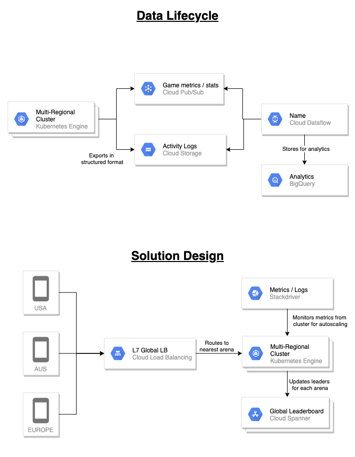

# Case Studies

Prior chapters of this course focused on individual components with a bit of a 
dive into the key products within the Google Cloud Platform. The next section
will focus on what is a large portion of the exam, being applying cloud concepts
to solve business and technical requirements at a higher level.

The exam will consist of four cases studies, all of which are available before
the exam. You can expect to see roughly 30% of questions related to the case 
studies, and they will be related to all four. This will equate to about 15-20
questions in total.

The questions you will want to ask about each case study are listed below. We 
will then dive into each of the case studies in detail and attempt to answer 
each of the questions in the context of the case study in the following 
sections.

1. Company Overview - What does the company do?
2. What are their pain points / why are they looking to use GCP?
3. Solution Concept - What are their goals / what are they looking to achieve?
4. Big Picture - What do they care about / what is their leadership looking for?
5. What are their business / technical requirements?
6. If applicable, what is their current environment and how would it translate to GCP given their above requirements?
7. If applicable, what does their infrastructure / data lifecycle look like?

The list of case studies can be found at the below link. Note, they
are subject to change over time so when viewing this, the case study
may have have differed to the notes in the following sections.

https://cloud.google.com/certification/guides/professional-cloud-architect

## Mountkirk Games

Link to case study: [mountkirk games](https://services.google.com/fh/files/blogs/master_case_study_mountkirk_games.pdf)

1. What does the company do?
   * Mobile game creator

2. What are their pain points?
   * 

3. What are their goals?
   * Expand to other platforms outside of the mobile space
   * Creation of a multi-platform FPS game
     * Ability to join specific geolocation arena from multiple locations
     * Realtime banner displaying leaders across all arenas
   * Game backend deployed on GKE
     * Ability to scale rapidly
     * Can use Google Global LoadBalancer to route players to nearest arena
   * Storage for global leaderboard on multi-regional spanner instance

4. What do they care about?
   * Reducing latency
   * Capturing analytics
   * Scaling
   * Global reach
   * Make use of managed services
   * Increase business agility
   * Reduce costs

5. Business requirements
   * Support multiple gaming platforms
   * Support multiple regions
     * Multi-regional spanner instance
     * Multi-regional GKE cluster with Global load balancer
   * Support rapid iteration of new features
   * Minimise latency
     * Low latency global load balancer
   * Optimise for dynamic scaling
     * Horizontally scalable database solution
     * Ability to scale up/down pods in GKE with demand
   * Use managed services / pooled resources
     * Managed Kubernetes
     * Managed database solutions
   * Cost savings
     * Autoscaling to only use what is needed

6. Technical requirements
   * Dynamically scale based on game activity
     * Stackdriver to moniter efficiency/performance
     * Automatically scale size of GKE cluster based metrics 
   * Publish scoring data in near real-time based on game activity
     * PubSub to provide multi regional data ingestion points
     * Dataflow to process activity data and store in Spanner
   * Store activity logs in structured files for future analysis
     * Store in json/avro format inside GCS bucket
     * Expose data for future analytics with BigQuery External Table 
   * Use GPU processing to render graphics server side for multi platform support
   * Support eventual migration of legacy games to new platform

7. Current environment / translated to GCP
   * Recently started migrating to GCP
     * 5 games migrated using lift and shift, running on VMs in GCE
   * New games isolated inside their own GCP project
   * Upper folder contains network policies for game projects nested under it
   * Legacy games all contained inside a single GCP project
   * Seperate environments for dev and test

8. Infrastructure / data lifecycle
   * See below

Additional solution references:
* https://cloud.google.com/architecture/mobile-gaming-analysis-telemetry

## ERH Healthcare

Link to case study: [erh healthcare](https://services.google.com/fh/files/blogs/master_case_study_ehr_healthcare.pdf)

1. What does the company do?
   * Offers SAS products for maintaing electronic health records to the medical industry

2. What are their pain points?
   * Costs associated with colocation model (time and money)
   * Inconsistencies between environments

3. What are their goals?
   * Migrate from their on-premise colocation model to cloud 
   * Enable business agility by scaling with demand and fasten deployment times
   * Uplift DR model to support cloud transition

4. What do they care about?
   * Resiliant platform with high availability
   * Consistency between environments
   * Improve monitoring to enable insights / analytics

5. Business requirements
   * Onboard new providers as quickly as possible
   * Minimum 99.9% availability for all customer facing applications
     * 'hot' dr patterns
     * Ensure replication servers are running / data replicated and auto cutover solutions (Cloud SQL)
     * Multi regional
   * Visibility on system performance / usage
     * Reports created based off cluster metrics 
   * Increase ability to provide insights into healthcare trends
     * Analytics capabilities (Big Query / Big Table)
   * Reduce latency to all customers
     * Global Load Balancer routing to nearest service
   * Maintain regulatory compliance
   * Decrease infra costs
     * Scale down when demand is not there.
     * Pay for what you use
   * Make predictions based off industry trends
     * Cloud ML reading from data ingested from sources

6. Technical requirements
   * Maintain legacy interfaces to insurance providers with connectivity between onprem / cloud
     * Cloud VPN / Cloud Interconnect options
     * TODO: Revisit these solutions to understand what is most suitable
   * Consistent way to manage Container based applications
     * GKE to run container based applications
     * Clusters setup to autoscale with demand
   * High performance connection  between onprem / cloud
     * Cloud Interconnect for high bandwith
   * Consistent logging, log retention, monitoring and alerting
     * Stackdriver to capture logs, metrics and setup alerts based off that
     * Options for alerts to notify non email communication methods
   * Dynamically scale and provision new environments
     * Resources defined via code and provisioned using Cloud Deployment Manager or alternate (Terraform / Ansible)
     * Provides consistency between environments which need to be provisioned
   * Create interfaces to ingest data from new providers
     * PubSub provides global data ingestion points
     * Possibility to introduce Cloud IOT if IOT devices potentially upload data in the future

7. Current environment / translated to GCP
   * Cloud Migration Process
     * Assess: Biggest ROI with the applications running on datacentre with expiring lease. Focus on containerised applications.
     * Pilot: Setup of projects, mapping of active directory to cloud IAM.
     * Move Data: 
       * MySQL / MS SQL -> Cloud SQL
       * MongoDB -> Cloud Datastore
       * Redis -> Managed redis instance
       * Assess the data transfer options available depending on size / bandwith
     * Move Applications:
       * Focus on containerised apps

8. Infrastructure / data lifecycle
   * TODO: Include diagram for data lifecycle / solution

Additional solution references:
   * DR Patterns:
      * High availability will mean hot patterns need to be applied.
      * Additional costs here to do so

## Helicopter Racing League

TODO: Complete analysis of case study

Link to case study: [helicopter racing league](https://services.google.com/fh/files/blogs/master_case_study_helicopter_racing_league.pdf)

1. What does the company do?
2. What are their pain points?
3. What are their goals?
4. What do they care about?
5. Business requirements
6. Technical requirements
7. Current environment / translated to GCP
8. Infrastructure / data lifecycle

Additional solution references:

## TerramEarth

TODO: Complete analysis of case study

Link to case study: [terramearth](https://services.google.com/fh/files/blogs/master_case_study_terramearth.pdf)

1. What does the company do?
2. What are their pain points?
3. What are their goals?
4. What do they care about?
5. Business requirements
6. Technical requirements
7. Current environment / translated to GCP
8. Infrastructure / data lifecycle

Additional solution references:
