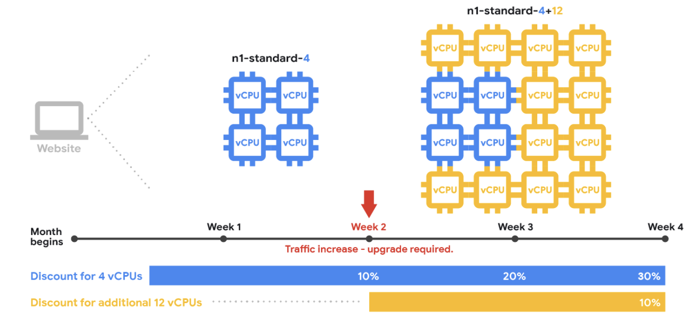

# Making the case for the Cloud / GCP

This section aims to help arm you with the points you need to know
to assist in discussions an Architect might have with upper 
leadership to convince them that migrating to the cloud is the right
path to go down.

Before engaging in these discussions you should be asking yourself 
the following questions:
* What does GCP do that we can't do now?
* Why should we migrate our resources to GCP?
* Why should out CEO, CFO, CIO care?

The why's will differ for each company / use case, but the most 
common 'why's' of moving to GCP include:

1. Saving costs
   * Do more with less cost
   * Trade CapEx for OpEx / No need to spend big upfront costs 

2. Future proof infrastructure
   * Hardware does not wear out
   * Time consuming process to upgrade hardware

3. Scale to meet demand
   * Elastic computing
   * Scale up / down as needed
   * Only pay for what you use

4. Data analytics / Big data
   * Deeper insights into customers / applications

5. Increase business agility
   * Create resource faster / on demand
   * No waiting for resources / hardware
   * Greater flexibility for experimentation

6. Leveredge managed services
   * Administrative overhead for hardware / services is gone
   * Frees up for more important tasks

7. Reach a global footprint
   * Easy worldwide presence
   * Multi national reach on same VPC network

8. Security at scale
   * Economies at scale at work
   * Resources are hosted on the same infra as google hosts their own
   * They have over 500 security engineers actively working on their infra
   * Ease of access management

## Cost Optimisation

All business want to achieve more for less costs. GCP has a few key 
cost saving concepts which should be known about to aid discussions.

1. Sustained use Discounts
   * Google automatically applies discounts on Compute Engine / Cloud SQL VM's
   * The longer the compute is used per month the larger the discount
   * A maximum discount of 30% can be obtained per month
   * Google does the math for you and factors in changes which might occur to your resource count without taking away any accrued discounts throughout the month. See below illustration where compute instances were upgraded from 4 to 16 halfway through the month

2. Free Tier
   * Different to a free trial which expires
   * Free tier allows customers to experiment with some GCP resources up to a fixed amount of compute within a period of time
   * Can experiment with resources within the free tier without accumulating costs

3. Custom Machine Types
   * Instead of using the pre defined machine types you can customise based on your use case
   * Unique to GCP
   * Choose from 0.9-6.5 GB RAM per CPU

4. Resizing Recommendations
   * GCP will give you notifications where it detects you could be saving costs based off your usage and the current machine type your application is working on

5. Preemptive VMs
   * Fault tolerant applications can run on pre emptive vms to save costs

6. Nearline / Coldline Storage
   * GCS buckets can be set to be nearline / coldline for reduced costs
   * Provides a mechanism to trade costs for access allowance per period

7. Committed Use Discounts
   * Up to 57% discount if you commit to 1 or 3 year term of set amount CPU / RAM
   * Billed for CPU/RAM amounts whether or not you are actually using them or not
   * This pool is not committed to your sustained usage discounts, only extra compute would be

## Architecting Cloud Applications

We are going to dive into 5 principles of good cloud application 
design. The same principles apply regardless of where the compute is
taking place (GAE, GKE, GCE), just need to understand how the 
principles work across the different compute options.

### High Availability

Aims to answer the question: "Can users access your application with
minimal latency?"

Here the placement of resources is key in achieving this. Need to 
first understand who are our users:
* Local company
* Public users nationally
* International audience

Once we understand this, we can begin to think about whether or not 
we need regional or multi-regional deployments. If we need 
mutil-regional we can serve traffic between these regions with a 
global load balancer.

### Scalability

This aims to answer the question around whether or not our 
application can scale up / down compute resources to meet demand.

Autoscaling is key here, where each of the compute services achieves
this slighty differently.
* GCE - Managed instance groups with autoscaling
* GKE - Cluster with autoscaling enabled (instance group under the hood)
* GAE - Autoscaling built in. Need to think about considerations on the environment.

### Security

Here we are trying to ensure we achieve the principle of least 
privledge, by ensuring we limit access only to those who require access to the resources.

To achieve this, we ensure administrative access to limited, and limit personal access via IAM roles required.

To restrict network traffic we ensure firewall rules are set only to what we need.

### Disaster Recovery

Here we plan around what will happen if a catastophe occurs and our
application goes 'boom'!

Ways in which we can achieve this are listed below:
* GCE snapshots for individual instances
* Failover servers
* Backup data to GCS bucket with nearline / coldline storage
* Ability to rollback application versions

### Costs

Need to understand the costs, and how to minimise costs for our 
application. Each compute service provides different options:
* GAE (Standard environment) - Set daily limits
* GAE (Flexible environment) - Set custom machine types
* GCE - Managed instance groups with autoscaling
* Custom machine types with selected resourcing for needs
* Pre emptive VMs for fault tolerant workloads
* Setting of resource quotas to guard against accidental spikes
