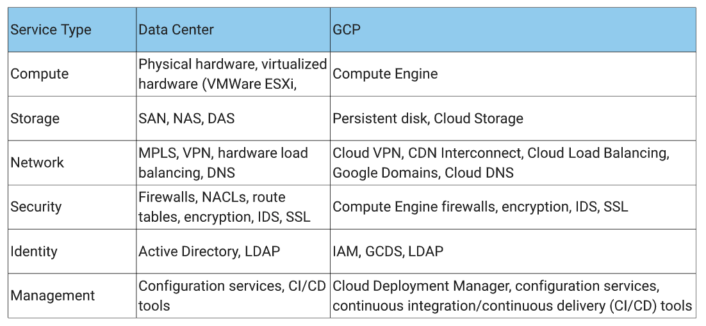
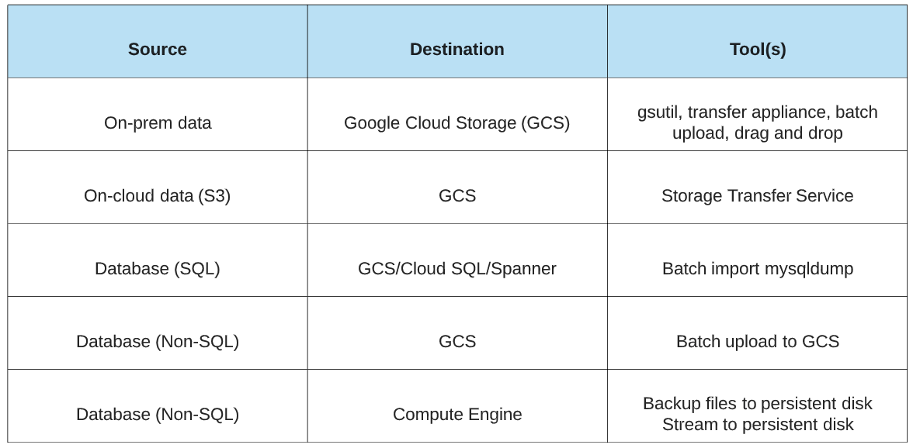
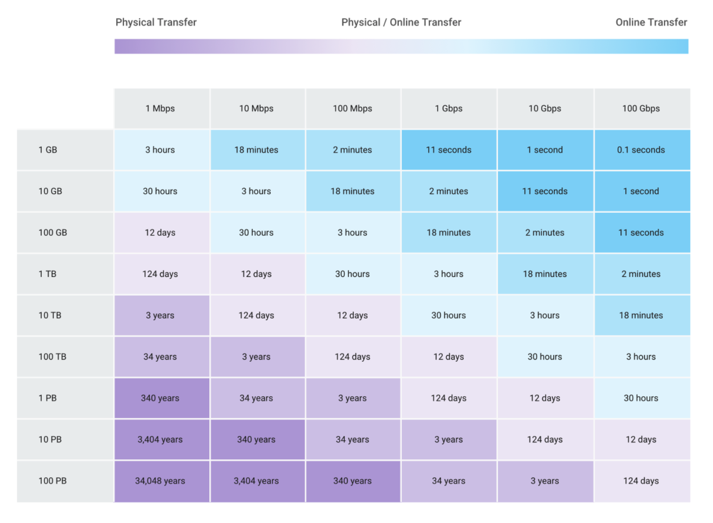

# Migrating to Google Cloud

Here we walk through the recommended approach for migrating 'stuff' to GCP.
By stuff, we are talking about Data (databases and unstructured storage) and
applications.

## Planning a successful Cloud Migration

The 5 phases to a successful cloud migration are as follows:

**Assess**

First off, we need to assess what we should move. Here we can categorise into 
the following buckets:

1. Easy to move
  * Newer / fewer dependencies
  * No / minimal licensing restrictions
  * Tolerant to scaling
  * Items where there may be a greater return on investment
  
2. Hard to move
  * More dependencies
  * Complex licensing restrictions
  * Less tolerant to scaling

3. Can't move
  * Non cloud compliant licensing (Oracle an example)
  * Requires specialised hardware
  * Compliance requirements

**Pilot**

Next we want to run a proof of concept, focusing on one of the use cases which
has been categorised as 'Easy to move'.
Here we will have to start thinking about mapping roles / structure to a cloud
compatible environment.
  * Projects / seperation of duties
  * Non Production / Test environments
  * VPCs

The below table will help provide a mapping of common On Premise - GCP solutions.

**Move data first**

Generally it is easier to move data across to GCP, hence this is why it is 
recommended to start with data migration and move applications across after.
The thing to consider here is your data transfer options. The below table 
highlights some common approaches to transfering data between different sources
and destinations.

**Move applications next**

Next we need to migrate our applications across to GCP. The recommended and 
easiest approach is to do a lift and shift, where you basically replicate your
running on prem environment into a duplicate VM environment on GCE.

Here we can choose to run a hybrid approach having resources both in cloud and 
on prem. A common approach is to use cloud as an initial DR recovery / cut over
point and make the case for a full migration across to the cloud.

**Optimise**

Now we have our data and applications on GCP. Next we can start to make use of 
the native cloud solutions to get the full benefits of cloud.
  * Enable autoscaling
  * Enhance redundancy with multiple availability zones
  * Make use of managed services
  * Monitoring capabilites
  * Decouple storage from application to enable elasticity
  * Loosely coupled inter service communication through PubSub

This will be a slow process, but continual optimisation will see your solution 
evolve into a fully cloud native solution.

## Storage Transfer Service

The storage transfer service allows another method for which you can use to 
transfer data into GCP. This is an alternate to the below methods:
  * gsutil
  * Web console

This service can only be used to transfer data from the below sources into a
GCS bucket sink
  * Amazon S3 bucket
  * HTTP/HTTPS
  * Another GCS bucket

A general rule of thumb for determining if we should use the Storage Transfer 
Service vs gsutil, if the source is another cloud provider use Storage Transfer
Service, if it is on prem, use gsutil.

Can be configured to run as a one of job or a recurring job. Can also choose to
delete objects from source once they have been transfered if we want.

## Data Migration Best Practices

The length of time it takes to transfer data depends on how 'far' away it is 
from GCP. 
  * From Cloud to Cloud (very close): Use Storage Transfer Service
  * From colocation or on-premise data center (close): Use gsutil
  * Slower connections / less bandwitch (far): Mail data in

The below table highlights the estimated time it will take to transfer data 
under the following bandwith.

We can do the following things to try and speed up data transfer times:
1. Reduce size of transfer
   * Deduplicate and compress
   * Grouping smaller files together

2. Increase network bandwith
   * Public internet connection
   * Cloud interconnect

When using gsutil you can use the following flags to help speed up transfer of 
objects.
1. Multi Threaded upload
   * Here this will help when you have many files which need uploading
   * Spreads files across threads to speed up
   * Can run using `gsutil -m cp` command

2. Parrallel Uploads
   * Breaks file up into smaller chunks for upload
   * Suitable for uploading of large files
   * Can run using `gsutil -o GSUtil:parallel_composite_upload_threshold=150M cp` 

When all else fails, and you have a large dataset with not a high amount of 
network bandwith, you can request a Transfer Appliance from Google, where you 
can then upload your data onto the appliance (data will be encrypted) and mail
it to Google, where they will then proceed to upload the data into a GCS bucket
for you. This would be a suitable option for anything which was going to take
over 3 years to upload.

## Migrating Applications

Before moving your server ensure you have created and thought about your structure
for projects, VPC network configurations and IAM roles which will need to be 
applied and who to.

Lift and Shift Options:
  * Recreate server environment on compute engine
    * Create new instance, install application / data
  * Import direct image
